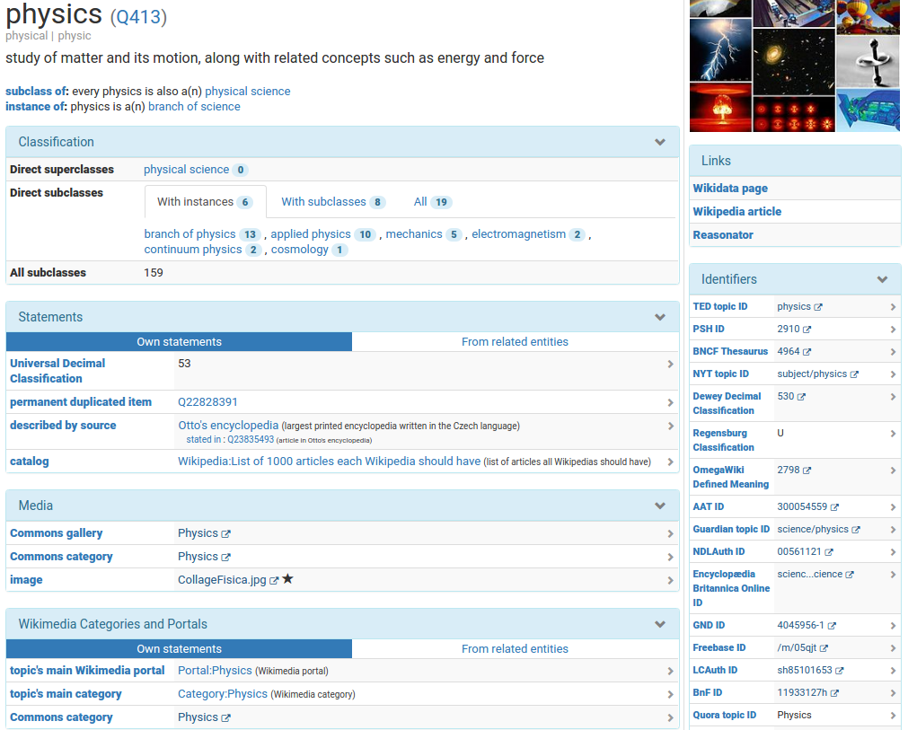

## Organisatorisches

* Geplant von 16-18 Uhr
    * Einführung, Übungen
    * Abfragen, WikiCite
* Bitte Fragen stellen!

<https://www.wikidata.org/wiki/User:JakobVoss/Bibtag2017>

---

{width=80%}

---

## Begriffsklärung

Wikipedia
  : freie Enzyklopädie in Form eines Wikis

Wikidata
  : freie Datenbank in Form eines Wikis

Wikimedia Foundation
  : Betreiber von Wikipedia und Wikidata

MediaWiki
  : gemeinsame Wiki-Software

## Freie Datenbank in Form eines Wikis?

* Freie Weiterverwendung der Daten (CC0)
* Freie und öffentliche Bearbeitung
* Versionierung (wann wurde was durch wen geändert)
* Datenbank

## Ziele von Wikidata

1. Wikipedia-Sprachversionen miteinander verknüpfen
2. Daten aus Wikipedia-Infoboxen zentral verwalten
3. Komplexe Abfragen über alle Daten

## Geschichte

* Die Idee gibt es seit mindestens 2004
* Erster Versuch: Semantic MediaWiki 2005 (Vrandečić/Krötzsch)
    * Entwicklung am KIT
    * Erfolgreich, aber nicht bei Wikimedia
* Zweiter Versuch: Wikidata 2012 (Vrandečić et al.)
    * Entwicklung bei Wikimedia Deutschland e.V.
    * Erste Version Ende 2012
    * Integration von Freebase 2015
    * Entwicklung noch nicht abgeschlossen

## Bestandteile

* Objekte/Items (`Q...`)
    * z.B. [Q2013] "Wikidata"
    * z.B. [Q18618629] "Denny Vrandečić"
    * z.B. [Q593744] "Wissensdatenbank"
* Eigenschaften/Properties (`P...`)
    * z.B. [P112] "Gründer"
    * z.B. [P31] "ist ein(e)"
* Normale Wiki-Seiten
    * Hilfe, Diskussionen...

---

## Übungen

* Bevölkerung von Frankfurt?
* Bevölkerung von anderen Frankfurts?
* Ideen für komplexere Abfragen?

--- 

## Weitere Bestadteile

* Bezeichnungen und Beschreibungen
* Qualifier
* Nachweise/Fundstellen

*Alles ist Item, Property oder Value!*

---

---

## Wikidata-Community

* Sehr offen
* Mehrsprachig
* Hilfe-Seiten verbesserungswürdig

# Bearbeitung

## Letzte Änderungen

* Wikidata Recent Changes (live stream)\
  <https://tools.wmflabs.org/wikidata-todo/rcvis.html>
* Versionsgeschichte von Items/Properties

## Übung: erste Bearbeitung

* Beliebige Bearbeitungen\
  <https://www.wikidata.org/wiki/Wikidata:Sandbox>

* Sinnvolle Bearbeitungen\
  z.B. Einträge zu Bibliotheken

## Zugriff per APIs

* Zugriff in JSON per MediaWiki-API
* Zugriff via RDF per SPARQL

* Verschiedenartige Darstellungen und Abfragen möglich
    * <http://www.wikidata.org/entity/Q22279816>
    * <https://tools.wmflabs.org/sqid/#/view?id=Q22279816>
    * <https://tools.wmflabs.org/reasonator/?&lang=de&q=22692845>
    * [Histropedia](http://histropedia.com/timeline/2j2stpg9bg0t/Pixar-animated-films)
    * ...

## Übung: Statements mit Qualifiern und Quellen

* DirektorInnen der Deutschen Nationalbibliothek

## Identifier in Wikidata

... GND, mix'n'match etc. ...

## Wikidata-Schemas

* Wikidata-Eigenschaften für Eigenschaften
* Noch nicht vollständig umgesetzt
* Validierung erst *nachträglich* und *optional*
* Beispiele:
    * GND-ID ([P227])
    * GCD Serien-ID ([P3589])

---

{width=100%}

# Wikidata Abfragen

...

* Föderierte Anfragemöglichkeiten (SPARQL federated queries)

## Tools

* Hay's Tools Directory\
  <https://tools.wmflabs.org/hay/directory/#/search/wikidata>
* unvollständig!

# WikiCite

...

## Wissenschaftliche Artikel in Wikidata

Wieviele Wissenschaftliche Artikel sind in Wikidata verzeichnet?

\small 

<https://finnaarupnielsen.wordpress.com/2017/05/25/some-statistics-on-scholarly-data-in-wikidata/>

