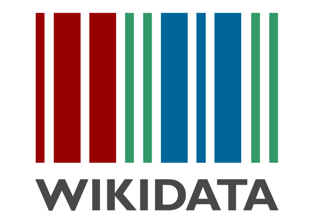

## Organisatorisches

* Geplant von 16-18 Uhr
    * Einführung, Übungen
    * Abfragen, WikiCite
* Bitte Fragen stellen!

<https://www.wikidata.org/wiki/User:JakobVoss/Bibtag2017>

<https://etherpad.wikimedia.org/p/bibtag2017>

Markdown-Quelltext dieser Folien (CC-BY-SA):\
<http://github.com/jakobib/bibtag2017>

---

{width=80%}

---

## Begriffsklärung

Wikipedia
  : freie Enzyklopädie in Form eines Wikis

Wikidata
  : freie Datenbank in Form eines Wikis

Wikimedia Foundation
  : Betreiber von Wikipedia und Wikidata

MediaWiki
  : gemeinsame Wiki-Software

## Freie Datenbank in Form eines Wikis?

* Freie Weiterverwendung der Daten (CC0)
* Freie und öffentliche Bearbeitung
* Versionierung (wann wurde was durch wen geändert)
* Datenbank

## Ziele von Wikidata

1. Wikipedia-Sprachversionen miteinander verknüpfen
2. Daten aus Wikipedia-Infoboxen zentral verwalten
3. Komplexe Abfragen über alle Daten

## Geschichte

* Die Idee gibt es seit mindestens 2004
* Erster Versuch: Semantic MediaWiki 2005 (Vrandečić/Krötzsch)
    * Entwicklung am KIT
    * Erfolgreich, aber nicht bei Wikimedia
* Zweiter Versuch: Wikidata 2012 (Vrandečić et al.)
    * Entwicklung bei Wikimedia Deutschland e.V.
    * Erste Version Ende 2012
    * Integration von Freebase 2015
    * Entwicklung noch nicht abgeschlossen

## Bestandteile

* Objekte/Items (`Q...`)
    * z.B. [Q2013] "Wikidata"
    * z.B. [Q18618629] "Denny Vrandečić"
    * z.B. [Q593744] "Wissensdatenbank"
* Eigenschaften/Properties (`P...`)
    * z.B. [P112] "Gründer"
    * z.B. [P31] "ist ein(e)"
* Normale Wiki-Seiten
    * Hilfe, Diskussionen...

---

{width=100%}

## Übungen

* Bevölkerung von Frankfurt?
* Bevölkerung von anderen Frankfurts?
* Ideen für komplexere Abfragen?

--- 

## Weitere Bestadteile

* Bezeichnungen und Beschreibungen
* Ränge
* Qualifier
* Fundstellen/Nachweise
* Datentypen

*Alles ist Item, Property oder Value!*

<https://www.wikidata.org/wiki/Wikidata:Glossary>

---

{height=70%}

## Datentypen

* Hängen von der Eigenschaft ab

<https://www.wikidata.org/wiki/Help:Data_type>

## Wikidata-Community

* Sehr offen
* Mehrsprachig
* Verschiedene Hilfe- und Einstiegsseiten
    * teilweise verbesserungswürdig

## Bearbeitung

* Letzte Änderungen
    * Wikidata Recent Changes (live stream)\
      <https://tools.wmflabs.org/wikidata-todo/rcvis.html>
    * Versionsgeschichte von Items/Properties

* Spielwiese für beliebige Bearbeitungen\
  <https://www.wikidata.org/wiki/Wikidata:Sandbox>

## Übung

* Beispiel: Einträge zu Bibliotheken ergänzen
    * Namen
    * Typ
    * Ort
    * Verbund
    * Leitung
    * ...

## Neue Items anlegen

* Geringere Relevanzriterien als in Wikipedia
* Wenn dann bitte etwas ausführlicher

## Zugriff per APIs

* Zugriff in JSON per MediaWiki-API
* Zugriff via RDF per SPARQL\
  <https://query.wikidata.org/>

* Verschiedenartige Darstellungen
    * <https://tools.wmflabs.org/reasonator/>
    * <https://tools.wmflabs.org/sqid/>
    * ...

## Übung

* DirektorInnen der Deutschen Nationalbibliothek
* Statements mit Qualifiern und Fundstellen!

## Demo: Abfragen

<https://query.wikidata.org/>

* Liste aller DirektorInnen der DNB
* Liste aller Bibliotheken im GBV

~~~sparql
SELECT ... WHERE {
   ...   
}
~~~

## Expertentool: Quickstatements

<https://tools.wmflabs.org/quickstatements/> (!)

* SUB Göttingen | Mitglied von | Kalliope
    * von | Verbundkatalog
    * importiert aus | ISIL-Verzeichnis

[Q564783|P463|Q1722480|P642|Q526334|S143|Q28657655](https://tools.wmflabs.org/quickstatements/#v1=Q564783|P463|Q1722480|P642|Q526334|S143|Q28657655)

---

## Quickstatements

{width=100%}

*Danke an Manuel Moch für die Anregung!*

## Weitere Tools

* [Wikidata:Tools](https://www.wikidata.org/wiki/Wikidata:Tools)
* Externe Tools
* Hay's Tools Directory\
  <https://tools.wmflabs.org/hay/directory/#/search/wikidata>
* Helferlein/Gadgets in den Benutzereinstellungen
* Benutzer-Skripte

*Listen leider unvollständig*

## Beispiel-Tools

* <https://tools.wmflabs.org/wikidata-game/distributed/>
* <https://tools.wmflabs.org/sourcemd/>

## Wie Datenmüll verhindern?

* Property Constraints
* Übung: Wie steht's um "Mitglied von" [P463]?
* Validierung erst *nachträglich* und *optional*\
  mit Hilfe von Abfragen

